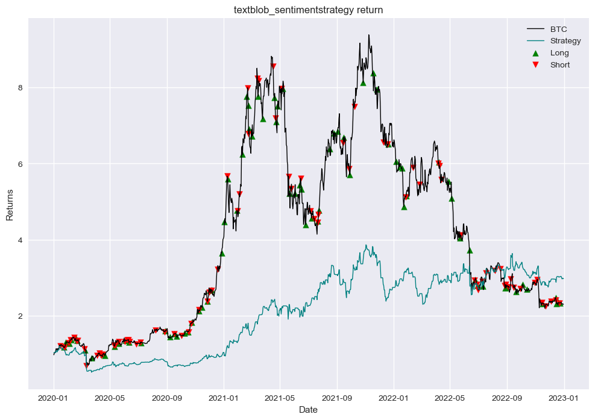
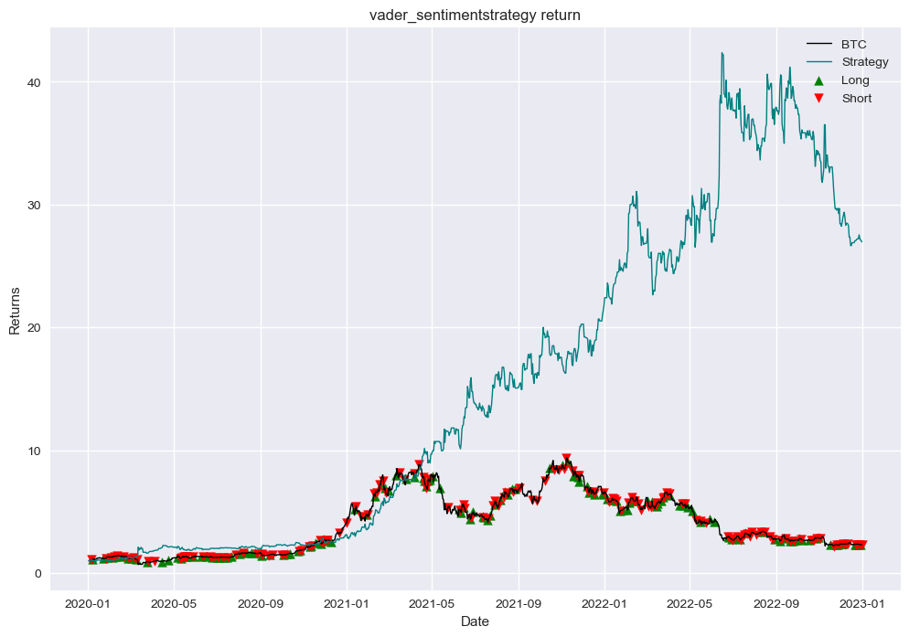

## Download Google News Articles

I tried many different methods to scrape news articles. Scraping Google News using the below method worked best for me:
- Use the requests_html library to scrape google news (library doesn't work in conda environment so need to run on another ide - I used VScode)
- use search query 'bitcoin', download articles for each month seperately and input into dataframe - approx 100 articles per month
- once complete, merge dataframes into one file and import into jupyter notebook
- code is below for reference

from requests_html import HTMLSession
import pandas as pd

query = 'bitcoin'
start_lst = ['2020-01-01', '2020-02-01','2020-03-01','2020-04-01','2020-05-01','2020-06-01','2020-07-01','2020-08-01','2020-09-01','2020-10-01','2020-11-01','2020-12-01',             '2021-01-01', '2021-02-01','2021-03-01','2021-04-01','2021-05-01','2021-06-01','2021-07-01','2021-08-01','2021-09-01','2021-10-01','2021-11-01','2021-12-01',             '2022-01-01', '2022-02-01','2022-03-01','2022-04-01','2022-05-01','2022-06-01','2022-07-01','2022-08-01','2022-09-01','2022-10-01','2022-11-01','2022-12-01']
end_lst = ['2020-01-31', '2020-02-29', '2020-03-31', '2020-04-30', '2020-05-31', '2020-06-30', '2020-07-31', '2020-08-31', '2020-09-30', '2020-10-31', '2020-11-30', '2020-12-31',           '2021-01-31', '2021-02-28', '2021-03-31', '2021-04-30', '2021-05-31', '2021-06-30', '2021-07-31', '2021-08-31', '2021-09-30', '2021-10-31', '2021-11-30', '2021-12-31',           '2022-01-31', '2022-02-28', '2022-03-31', '2022-04-30', '2022-05-31', '2022-06-30', '2022-07-31', '2022-08-31', '2022-09-30', '2022-10-31', '2022-11-30', '2022-12-31']

newslist = []

for start, end in zip(start_lst, end_lst):
    session = HTMLSession()
    r = session.get('https://news.google.com/search?q={}%20before%3A{}%20after%3A{}&hl=en-GB&gl=GB&ceid=GB%3Aen'.format(query, end, start), timeout=1000)
    # render the html, sleep=1 to give it a second to finish before moving on. scrolldown= how many times to page down on the browser, to get more results. 5 was a good number here
    r.html.render(sleep=1, scrolldown=5)
    # print(start, end)
    articles = r.html.find('article')
    # print(articles)

    for item in articles:
        try:
            newsitem = item.find('h3', first=True)
            time = item.find('time', first=True)
            datetime = time.attrs['datetime']
            title = newsitem.text
            link = newsitem.absolute_links
            newsarticle = {
                'datetime': datetime,
                'title': title,
                'link': link 
            }
            newslist.append(newsarticle)
            
        except:
            pass
    print(start, end)
    df = pd.DataFrame(newslist)
    df.to_csv('google_news_{}_{}_{}.csv'.format(query, start_lst[0], end_lst[-1]))
    # print(df)

## Import News Articles into Jupyter Notebook

I prefer to work in jupyter notebooks, so I imported the data here.


```python
import pandas as pd

df = pd.read_csv('google_news_bitcoin_2020-01-01_2022-12-31.csv', parse_dates=True, index_col='datetime').sort_index()
df = df.iloc[:,1:-1]
df = df.loc['2020-01-01':'2023-01-01']
df
```


<div>
<style scoped>
    .dataframe tbody tr th:only-of-type {
        vertical-align: middle;
    }

    .dataframe tbody tr th {
        vertical-align: top;
    }

    .dataframe thead th {
        text-align: right;
    }
</style>
<table border="1" class="dataframe">
  <thead>
    <tr style="text-align: right;">
      <th></th>
      <th>title</th>
    </tr>
    <tr>
      <th>datetime</th>
      <th></th>
    </tr>
  </thead>
  <tbody>
    <tr>
      <th>2020-01-01 08:00:00+00:00</th>
      <td>Worst Bitcoin Price Prediction of 2019</td>
    </tr>
    <tr>
      <th>2020-01-01 08:00:00+00:00</th>
      <td>Bitcoin: 4 Big Competitive Advantages Over Alt...</td>
    </tr>
    <tr>
      <th>2020-01-01 08:00:00+00:00</th>
      <td>From crypto currency to chocolate, where to sp...</td>
    </tr>
    <tr>
      <th>2020-01-01 08:00:00+00:00</th>
      <td>Bitcoin Price Will Crash Below $1k in 2020, Ze...</td>
    </tr>
    <tr>
      <th>2020-01-03 08:00:00+00:00</th>
      <td>Happy birthday Bitcoin! Celebrating the life o...</td>
    </tr>
    <tr>
      <th>...</th>
      <td>...</td>
    </tr>
    <tr>
      <th>2022-12-29 08:00:00+00:00</th>
      <td>Will This Country Be the Next to Make Bitcoin ...</td>
    </tr>
    <tr>
      <th>2022-12-30 08:00:00+00:00</th>
      <td>What Do Bitcoin Investors Need To Know In Thes...</td>
    </tr>
    <tr>
      <th>2022-12-30 08:00:00+00:00</th>
      <td>Billionaire Mark Cuban Reveals When He’d Buy B...</td>
    </tr>
    <tr>
      <th>2022-12-30 08:00:00+00:00</th>
      <td>What Is Counterparty? Historical NFTs Built on...</td>
    </tr>
    <tr>
      <th>2022-12-31 08:00:00+00:00</th>
      <td>Bitcoin at $200,000 projections flop as coin e...</td>
    </tr>
  </tbody>
</table>
<p>5437 rows × 1 columns</p>
</div>


## Article Statistics


Most months have approx 100 titles, but some months have more, I have decided to leave all articles as more data should provide greater accuracy


```python
df.groupby(pd.Grouper(freq='M')).count()
```


<div>
<style scoped>
    .dataframe tbody tr th:only-of-type {
        vertical-align: middle;
    }

    .dataframe tbody tr th {
        vertical-align: top;
    }

    .dataframe thead th {
        text-align: right;
    }
</style>
<table border="1" class="dataframe">
  <thead>
    <tr style="text-align: right;">
      <th></th>
      <th>title</th>
    </tr>
    <tr>
      <th>datetime</th>
      <th></th>
    </tr>
  </thead>
  <tbody>
    <tr>
      <th>2020-01-31 00:00:00+00:00</th>
      <td>98</td>
    </tr>
    <tr>
      <th>2020-02-29 00:00:00+00:00</th>
      <td>98</td>
    </tr>
    <tr>
      <th>2020-03-31 00:00:00+00:00</th>
      <td>98</td>
    </tr>
    <tr>
      <th>2020-04-30 00:00:00+00:00</th>
      <td>99</td>
    </tr>
    <tr>
      <th>2020-05-31 00:00:00+00:00</th>
      <td>97</td>
    </tr>
    <tr>
      <th>2020-06-30 00:00:00+00:00</th>
      <td>93</td>
    </tr>
    <tr>
      <th>2020-07-31 00:00:00+00:00</th>
      <td>97</td>
    </tr>
    <tr>
      <th>2020-08-31 00:00:00+00:00</th>
      <td>94</td>
    </tr>
    <tr>
      <th>2020-09-30 00:00:00+00:00</th>
      <td>92</td>
    </tr>
    <tr>
      <th>2020-10-31 00:00:00+00:00</th>
      <td>128</td>
    </tr>
    <tr>
      <th>2020-11-30 00:00:00+00:00</th>
      <td>99</td>
    </tr>
    <tr>
      <th>2020-12-31 00:00:00+00:00</th>
      <td>101</td>
    </tr>
    <tr>
      <th>2021-01-31 00:00:00+00:00</th>
      <td>99</td>
    </tr>
    <tr>
      <th>2021-02-28 00:00:00+00:00</th>
      <td>99</td>
    </tr>
    <tr>
      <th>2021-03-31 00:00:00+00:00</th>
      <td>97</td>
    </tr>
    <tr>
      <th>2021-04-30 00:00:00+00:00</th>
      <td>100</td>
    </tr>
    <tr>
      <th>2021-05-31 00:00:00+00:00</th>
      <td>100</td>
    </tr>
    <tr>
      <th>2021-06-30 00:00:00+00:00</th>
      <td>98</td>
    </tr>
    <tr>
      <th>2021-07-31 00:00:00+00:00</th>
      <td>98</td>
    </tr>
    <tr>
      <th>2021-08-31 00:00:00+00:00</th>
      <td>99</td>
    </tr>
    <tr>
      <th>2021-09-30 00:00:00+00:00</th>
      <td>98</td>
    </tr>
    <tr>
      <th>2021-10-31 00:00:00+00:00</th>
      <td>100</td>
    </tr>
    <tr>
      <th>2021-11-30 00:00:00+00:00</th>
      <td>98</td>
    </tr>
    <tr>
      <th>2021-12-31 00:00:00+00:00</th>
      <td>98</td>
    </tr>
    <tr>
      <th>2022-01-31 00:00:00+00:00</th>
      <td>201</td>
    </tr>
    <tr>
      <th>2022-02-28 00:00:00+00:00</th>
      <td>97</td>
    </tr>
    <tr>
      <th>2022-03-31 00:00:00+00:00</th>
      <td>595</td>
    </tr>
    <tr>
      <th>2022-04-30 00:00:00+00:00</th>
      <td>485</td>
    </tr>
    <tr>
      <th>2022-05-31 00:00:00+00:00</th>
      <td>392</td>
    </tr>
    <tr>
      <th>2022-06-30 00:00:00+00:00</th>
      <td>294</td>
    </tr>
    <tr>
      <th>2022-07-31 00:00:00+00:00</th>
      <td>196</td>
    </tr>
    <tr>
      <th>2022-08-31 00:00:00+00:00</th>
      <td>100</td>
    </tr>
    <tr>
      <th>2022-09-30 00:00:00+00:00</th>
      <td>305</td>
    </tr>
    <tr>
      <th>2022-10-31 00:00:00+00:00</th>
      <td>200</td>
    </tr>
    <tr>
      <th>2022-11-30 00:00:00+00:00</th>
      <td>99</td>
    </tr>
    <tr>
      <th>2022-12-31 00:00:00+00:00</th>
      <td>95</td>
    </tr>
  </tbody>
</table>
</div>


## Preprocessing for Sentiment Analysis

For greater accuracy, it is common practice to normalize text data before running any sentiment analysis. Below is a list of the text normalization steps, followed by the code:
- Remove non-English characters
- Remove numbers
- Fix contractions (e.g. wasn't == was not)
- Stem words (e.g. trading == trade)
- Remove stop words (filter words e.g. “a,” “the,” “is,” “are,”)
- Tokenize words


```python
import re
from contractions import fix
from nltk.stem.snowball import SnowballStemmer
from nltk.tokenize import word_tokenize
from nltk.corpus import stopwords

def normalize_text(article):
    # remove non-English characters 
    article = re.sub(r'[^\x00-\x7F]+', "", article)
    # remove numbers
    article = re.sub(r"\d+", "", article)
    # fix contractions
    article = fix(article)
    # stem words
    ss = SnowballStemmer("english")
    tokens = word_tokenize(article)
    tokens = [ss.stem(token) for token in tokens]
    # remove stop words
    stop_words = set([word for word in stopwords.words('english') if word != 'not'])
    tokens = [token for token in tokens if not token in stop_words]
    # join tokens back into a single string
    article = " ".join(tokens)
    return article

normalized_article = []

for title in df.title:
    result = normalize_text(title)
    normalized_article.append(result)

df['title_normalized'] = normalized_article
df
```


<div>
<style scoped>
    .dataframe tbody tr th:only-of-type {
        vertical-align: middle;
    }

    .dataframe tbody tr th {
        vertical-align: top;
    }

    .dataframe thead th {
        text-align: right;
    }
</style>
<table border="1" class="dataframe">
  <thead>
    <tr style="text-align: right;">
      <th></th>
      <th>title</th>
      <th>title_norm</th>
    </tr>
    <tr>
      <th>datetime</th>
      <th></th>
      <th></th>
    </tr>
  </thead>
  <tbody>
    <tr>
      <th>2020-01-01 08:00:00+00:00</th>
      <td>Worst Bitcoin Price Prediction of 2019</td>
      <td>worst bitcoin price predict</td>
    </tr>
    <tr>
      <th>2020-01-01 08:00:00+00:00</th>
      <td>Bitcoin: 4 Big Competitive Advantages Over Alt...</td>
      <td>bitcoin : big competit advantag altcoin</td>
    </tr>
    <tr>
      <th>2020-01-01 08:00:00+00:00</th>
      <td>From crypto currency to chocolate, where to sp...</td>
      <td>crypto currenc chocol , spend bitcoin</td>
    </tr>
    <tr>
      <th>2020-01-01 08:00:00+00:00</th>
      <td>Bitcoin Price Will Crash Below $1k in 2020, Ze...</td>
      <td>bitcoin price crash $ k , zengo ceo joke predict</td>
    </tr>
    <tr>
      <th>2020-01-03 08:00:00+00:00</th>
      <td>Happy birthday Bitcoin! Celebrating the life o...</td>
      <td>happi birthday bitcoin ! celebr life remark -y...</td>
    </tr>
    <tr>
      <th>...</th>
      <td>...</td>
      <td>...</td>
    </tr>
    <tr>
      <th>2022-12-29 08:00:00+00:00</th>
      <td>Will This Country Be the Next to Make Bitcoin ...</td>
      <td>countri next make bitcoin offici currenc ?</td>
    </tr>
    <tr>
      <th>2022-12-30 08:00:00+00:00</th>
      <td>What Do Bitcoin Investors Need To Know In Thes...</td>
      <td>bitcoin investor need know frozen market ?</td>
    </tr>
    <tr>
      <th>2022-12-30 08:00:00+00:00</th>
      <td>Billionaire Mark Cuban Reveals When He’d Buy B...</td>
      <td>billionair mark cuban reveal would buy bitcoin...</td>
    </tr>
    <tr>
      <th>2022-12-30 08:00:00+00:00</th>
      <td>What Is Counterparty? Historical NFTs Built on...</td>
      <td>counterparti ? histor nfts built bitcoin</td>
    </tr>
    <tr>
      <th>2022-12-31 08:00:00+00:00</th>
      <td>Bitcoin at $200,000 projections flop as coin e...</td>
      <td>bitcoin $ , project flop coin end year %</td>
    </tr>
  </tbody>
</table>
<p>5437 rows × 2 columns</p>
</div>


## Calculate Sentiment

There are many methods to calculate Sentiment. I will explore all of these methods.

1. Build your own model
- Manually label a sample of the data either with positive, negative or neutral
- Build and train a machine learning model
- Use the model to predict sentiment for unlabelled data and future data
- This is the most accurate method but is also the most time consuming

2. Use Pre-trained model
- Libraries like TextBlob and Vader have been pre-trained and can eaily be used on your data
- This is much quicker to implement but not as accurate, and therefore not usually advised for real trading

## Sentiment Using TextBlob - Naive Bayes classifier

TextBlob's sentiment analysis is based on a machine learning approach, specifically a Naive Bayes classifier.

The sentiment analysis algorithm in TextBlob works by training a Naive Bayes classifier on a large dataset of labeled text, where each piece of text is labeled with a sentiment score (positive, negative, or neutral). The algorithm uses this labeled dataset to learn patterns and associations between certain words and their associated sentiment scores.

When processing a new piece of text, TextBlob's sentiment analysis algorithm calculates the probability that the text belongs to each of the three sentiment categories (positive, negative, or neutral) based on the words in the text and their associated sentiment scores. The algorithm then assigns the text to the category with the highest probability score.

TextBlob's sentiment analysis also takes into account various linguistic features of the text, such as part-of-speech tagging, noun phrase extraction, and parsing. These features help to improve the accuracy of the sentiment analysis by providing additional information about the structure and meaning of the text.

Overall, TextBlob's sentiment analysis is a machine learning-based approach that uses a labeled dataset to train a Naive Bayes classifier and calculate the probability that a new piece of text belongs to a particular sentiment category.


```python
from textblob import TextBlob

def textblob_sentiment(text):
    blob = TextBlob(text)
    polarity = blob.sentiment.polarity
    return polarity

df['textblob_sentiment'] = df['title_normalized'].apply(textblob_sentiment)
df
```


<div>
<style scoped>
    .dataframe tbody tr th:only-of-type {
        vertical-align: middle;
    }

    .dataframe tbody tr th {
        vertical-align: top;
    }

    .dataframe thead th {
        text-align: right;
    }
</style>
<table border="1" class="dataframe">
  <thead>
    <tr style="text-align: right;">
      <th></th>
      <th>title</th>
      <th>title_norm</th>
      <th>textblob_sentiment</th>
    </tr>
    <tr>
      <th>datetime</th>
      <th></th>
      <th></th>
      <th></th>
    </tr>
  </thead>
  <tbody>
    <tr>
      <th>2020-01-01 08:00:00+00:00</th>
      <td>Worst Bitcoin Price Prediction of 2019</td>
      <td>worst bitcoin price predict</td>
      <td>-1.0</td>
    </tr>
    <tr>
      <th>2020-01-01 08:00:00+00:00</th>
      <td>Bitcoin: 4 Big Competitive Advantages Over Alt...</td>
      <td>bitcoin : big competit advantag altcoin</td>
      <td>0.0</td>
    </tr>
    <tr>
      <th>2020-01-01 08:00:00+00:00</th>
      <td>From crypto currency to chocolate, where to sp...</td>
      <td>crypto currenc chocol , spend bitcoin</td>
      <td>0.0</td>
    </tr>
    <tr>
      <th>2020-01-01 08:00:00+00:00</th>
      <td>Bitcoin Price Will Crash Below $1k in 2020, Ze...</td>
      <td>bitcoin price crash $ k , zengo ceo joke predict</td>
      <td>0.0</td>
    </tr>
    <tr>
      <th>2020-01-03 08:00:00+00:00</th>
      <td>Happy birthday Bitcoin! Celebrating the life o...</td>
      <td>happi birthday bitcoin ! celebr life remark -y...</td>
      <td>0.0</td>
    </tr>
    <tr>
      <th>...</th>
      <td>...</td>
      <td>...</td>
      <td>...</td>
    </tr>
    <tr>
      <th>2022-12-29 08:00:00+00:00</th>
      <td>Will This Country Be the Next to Make Bitcoin ...</td>
      <td>countri next make bitcoin offici currenc ?</td>
      <td>0.0</td>
    </tr>
    <tr>
      <th>2022-12-30 08:00:00+00:00</th>
      <td>What Do Bitcoin Investors Need To Know In Thes...</td>
      <td>bitcoin investor need know frozen market ?</td>
      <td>0.0</td>
    </tr>
    <tr>
      <th>2022-12-30 08:00:00+00:00</th>
      <td>Billionaire Mark Cuban Reveals When He’d Buy B...</td>
      <td>billionair mark cuban reveal would buy bitcoin...</td>
      <td>0.4</td>
    </tr>
    <tr>
      <th>2022-12-30 08:00:00+00:00</th>
      <td>What Is Counterparty? Historical NFTs Built on...</td>
      <td>counterparti ? histor nfts built bitcoin</td>
      <td>0.0</td>
    </tr>
    <tr>
      <th>2022-12-31 08:00:00+00:00</th>
      <td>Bitcoin at $200,000 projections flop as coin e...</td>
      <td>bitcoin $ , project flop coin end year %</td>
      <td>0.0</td>
    </tr>
  </tbody>
</table>
<p>5437 rows × 3 columns</p>
</div>


## Sentiment Using Vader - rule-based using lexicon

VADER (Valence Aware Dictionary and Sentiment Reasoner) is a rule-based sentiment analysis tool that uses a lexicon of words and their associated sentiment scores to determine the sentiment of a given piece of text.

The lexicon used in VADER contains over 7,500 words and phrases that are labeled with a positive or negative sentiment score, ranging from -4 (most negative) to +4 (most positive), with 0 representing a neutral sentiment.

When processing a piece of text, VADER breaks it down into individual words and looks up each word in its lexicon. The sentiment scores of all the words in the text are then combined to produce an overall sentiment score for the text.

VADER also takes into account the context and intensity of the sentiment expressed by each word, as well as features such as capitalization and punctuation. For example, an all-caps word is likely to be interpreted as more intense than the same word in lowercase letters.

Overall, VADER is a useful tool for sentiment analysis because it takes into account the nuances and complexities of natural language and can provide accurate sentiment scores for a wide range of texts.

Researchers at the University of Alberta, who used VADER to analyze the sentiment of headlines from major news outlets found that VADER was able to accurately classify the sentiment of the majority of headlines, with an overall accuracy rate of around 85%. The study also found that VADER performed better at identifying negative sentiment than positive sentiment, which is consistent with other studies of sentiment analysis tools.

Another study, published in the Journal of Information Science, evaluated the performance of several sentiment analysis tools, including VADER, on a dataset of news headlines. The study found that VADER had a high accuracy rate for identifying the overall sentiment of headlines, but that it struggled with more nuanced sentiment analysis, such as identifying the tone of a headline as being ironic or sarcastic.

Overall, these studies suggest that VADER can be a useful tool for analyzing the sentiment of news headlines, but that it may have limitations when it comes to more complex forms of sentiment analysis. As with any sentiment analysis tool, it is important to evaluate the results of VADER analysis on a case-by-case basis and to consider the context and limitations of the tool.


```python
from nltk.sentiment.vader import SentimentIntensityAnalyzer
import pandas as pd

analyzer = SentimentIntensityAnalyzer()

def get_sentiment(text):
    scores = analyzer.polarity_scores(text)
    return scores['compound']

df['vader_sentiment'] = df['title_normalized'].apply(get_sentiment)
df
```


<div>
<style scoped>
    .dataframe tbody tr th:only-of-type {
        vertical-align: middle;
    }

    .dataframe tbody tr th {
        vertical-align: top;
    }

    .dataframe thead th {
        text-align: right;
    }
</style>
<table border="1" class="dataframe">
  <thead>
    <tr style="text-align: right;">
      <th></th>
      <th>title</th>
      <th>title_norm</th>
      <th>textblob_sentiment</th>
      <th>vader_sentiment</th>
    </tr>
    <tr>
      <th>datetime</th>
      <th></th>
      <th></th>
      <th></th>
      <th></th>
    </tr>
  </thead>
  <tbody>
    <tr>
      <th>2020-01-01 08:00:00+00:00</th>
      <td>Worst Bitcoin Price Prediction of 2019</td>
      <td>worst bitcoin price predict</td>
      <td>-1.0</td>
      <td>-0.6249</td>
    </tr>
    <tr>
      <th>2020-01-01 08:00:00+00:00</th>
      <td>Bitcoin: 4 Big Competitive Advantages Over Alt...</td>
      <td>bitcoin : big competit advantag altcoin</td>
      <td>0.0</td>
      <td>0.0000</td>
    </tr>
    <tr>
      <th>2020-01-01 08:00:00+00:00</th>
      <td>From crypto currency to chocolate, where to sp...</td>
      <td>crypto currenc chocol , spend bitcoin</td>
      <td>0.0</td>
      <td>0.0000</td>
    </tr>
    <tr>
      <th>2020-01-01 08:00:00+00:00</th>
      <td>Bitcoin Price Will Crash Below $1k in 2020, Ze...</td>
      <td>bitcoin price crash $ k , zengo ceo joke predict</td>
      <td>0.0</td>
      <td>-0.1280</td>
    </tr>
    <tr>
      <th>2020-01-03 08:00:00+00:00</th>
      <td>Happy birthday Bitcoin! Celebrating the life o...</td>
      <td>happi birthday bitcoin ! celebr life remark -y...</td>
      <td>0.0</td>
      <td>0.0000</td>
    </tr>
    <tr>
      <th>...</th>
      <td>...</td>
      <td>...</td>
      <td>...</td>
      <td>...</td>
    </tr>
    <tr>
      <th>2022-12-29 08:00:00+00:00</th>
      <td>Will This Country Be the Next to Make Bitcoin ...</td>
      <td>countri next make bitcoin offici currenc ?</td>
      <td>0.0</td>
      <td>0.0000</td>
    </tr>
    <tr>
      <th>2022-12-30 08:00:00+00:00</th>
      <td>What Do Bitcoin Investors Need To Know In Thes...</td>
      <td>bitcoin investor need know frozen market ?</td>
      <td>0.0</td>
      <td>0.0000</td>
    </tr>
    <tr>
      <th>2022-12-30 08:00:00+00:00</th>
      <td>Billionaire Mark Cuban Reveals When He’d Buy B...</td>
      <td>billionair mark cuban reveal would buy bitcoin...</td>
      <td>0.4</td>
      <td>0.3182</td>
    </tr>
    <tr>
      <th>2022-12-30 08:00:00+00:00</th>
      <td>What Is Counterparty? Historical NFTs Built on...</td>
      <td>counterparti ? histor nfts built bitcoin</td>
      <td>0.0</td>
      <td>0.0000</td>
    </tr>
    <tr>
      <th>2022-12-31 08:00:00+00:00</th>
      <td>Bitcoin at $200,000 projections flop as coin e...</td>
      <td>bitcoin $ , project flop coin end year %</td>
      <td>0.0</td>
      <td>-0.3400</td>
    </tr>
  </tbody>
</table>
<p>5437 rows × 4 columns</p>
</div>


## Sum Daily Polarity

For my back test, I will be using daily btc price data and therefore I need to resample to sentiment data to match. The sentiment for each day will be summed, for example, if I have 3 articles with polarity, 0.1, -0.3, 0.9, the polarity for that day will be the summed total, 0.7. The total dataframe size has been reduced from 5437 to 1096 as a result of this change. 


```python
polarity_sum = df[['textblob_sentiment', 'vader_sentiment']].resample('1D').sum()
polarity_sum
```


<div>
<style scoped>
    .dataframe tbody tr th:only-of-type {
        vertical-align: middle;
    }

    .dataframe tbody tr th {
        vertical-align: top;
    }

    .dataframe thead th {
        text-align: right;
    }
</style>
<table border="1" class="dataframe">
  <thead>
    <tr style="text-align: right;">
      <th></th>
      <th>textblob_sentiment</th>
      <th>vader_sentiment</th>
    </tr>
    <tr>
      <th>datetime</th>
      <th></th>
      <th></th>
    </tr>
  </thead>
  <tbody>
    <tr>
      <th>2020-01-01 00:00:00+00:00</th>
      <td>-1.000</td>
      <td>-0.7529</td>
    </tr>
    <tr>
      <th>2020-01-02 00:00:00+00:00</th>
      <td>0.000</td>
      <td>0.0000</td>
    </tr>
    <tr>
      <th>2020-01-03 00:00:00+00:00</th>
      <td>0.000</td>
      <td>0.0000</td>
    </tr>
    <tr>
      <th>2020-01-04 00:00:00+00:00</th>
      <td>0.350</td>
      <td>0.3612</td>
    </tr>
    <tr>
      <th>2020-01-05 00:00:00+00:00</th>
      <td>0.000</td>
      <td>0.5562</td>
    </tr>
    <tr>
      <th>...</th>
      <td>...</td>
      <td>...</td>
    </tr>
    <tr>
      <th>2022-12-27 00:00:00+00:00</th>
      <td>1.125</td>
      <td>0.3187</td>
    </tr>
    <tr>
      <th>2022-12-28 00:00:00+00:00</th>
      <td>0.250</td>
      <td>-0.6364</td>
    </tr>
    <tr>
      <th>2022-12-29 00:00:00+00:00</th>
      <td>0.000</td>
      <td>0.3612</td>
    </tr>
    <tr>
      <th>2022-12-30 00:00:00+00:00</th>
      <td>0.400</td>
      <td>0.3182</td>
    </tr>
    <tr>
      <th>2022-12-31 00:00:00+00:00</th>
      <td>0.000</td>
      <td>-0.3400</td>
    </tr>
  </tbody>
</table>
<p>1096 rows × 2 columns</p>
</div>


## Get BTC Returns

Now time to import btc price data for the same time interval and calculate the log returns.


```python
#import btc returns data
import datetime
import yfinance as yf
import numpy as np

def get_market_data(ticker, start_date, end_date, interval):
    data = yf.download(ticker, start=start_date, end=end_date, interval=interval, group_by='ticker', ignore_tz = False)
    data["returns"] = np.log(data.Close / data.Close.shift(1))
    return data[["returns"]]

end_date = '2022-12-31'
start_date = '2020-01-01'
interval = '1D'

df_btc = get_market_data("BTC-USD", start_date, end_date, interval)
df_btc.index = df_btc.index.tz_localize('UTC')
df_btc
```

    [*********************100%***********************]  1 of 1 completed


<div>
<style scoped>
    .dataframe tbody tr th:only-of-type {
        vertical-align: middle;
    }

    .dataframe tbody tr th {
        vertical-align: top;
    }

    .dataframe thead th {
        text-align: right;
    }
</style>
<table border="1" class="dataframe">
  <thead>
    <tr style="text-align: right;">
      <th></th>
      <th>returns</th>
    </tr>
    <tr>
      <th>Date</th>
      <th></th>
    </tr>
  </thead>
  <tbody>
    <tr>
      <th>2020-01-01 00:00:00+00:00</th>
      <td>NaN</td>
    </tr>
    <tr>
      <th>2020-01-02 00:00:00+00:00</th>
      <td>-0.030273</td>
    </tr>
    <tr>
      <th>2020-01-03 00:00:00+00:00</th>
      <td>0.050172</td>
    </tr>
    <tr>
      <th>2020-01-04 00:00:00+00:00</th>
      <td>0.008915</td>
    </tr>
    <tr>
      <th>2020-01-05 00:00:00+00:00</th>
      <td>0.000089</td>
    </tr>
    <tr>
      <th>...</th>
      <td>...</td>
    </tr>
    <tr>
      <th>2022-12-27 00:00:00+00:00</th>
      <td>-0.012048</td>
    </tr>
    <tr>
      <th>2022-12-28 00:00:00+00:00</th>
      <td>-0.009895</td>
    </tr>
    <tr>
      <th>2022-12-29 00:00:00+00:00</th>
      <td>0.005409</td>
    </tr>
    <tr>
      <th>2022-12-30 00:00:00+00:00</th>
      <td>-0.002392</td>
    </tr>
    <tr>
      <th>2022-12-31 00:00:00+00:00</th>
      <td>-0.003324</td>
    </tr>
  </tbody>
</table>
<p>1096 rows × 1 columns</p>
</div>


## Join Dataframes


```python
data = polarity_sum.join(df_btc)
data
```


<div>
<style scoped>
    .dataframe tbody tr th:only-of-type {
        vertical-align: middle;
    }

    .dataframe tbody tr th {
        vertical-align: top;
    }

    .dataframe thead th {
        text-align: right;
    }
</style>
<table border="1" class="dataframe">
  <thead>
    <tr style="text-align: right;">
      <th></th>
      <th>textblob_sentiment</th>
      <th>vader_sentiment</th>
      <th>returns</th>
    </tr>
    <tr>
      <th>datetime</th>
      <th></th>
      <th></th>
      <th></th>
    </tr>
  </thead>
  <tbody>
    <tr>
      <th>2020-01-01 00:00:00+00:00</th>
      <td>-1.000</td>
      <td>-0.7529</td>
      <td>NaN</td>
    </tr>
    <tr>
      <th>2020-01-02 00:00:00+00:00</th>
      <td>0.000</td>
      <td>0.0000</td>
      <td>-0.030273</td>
    </tr>
    <tr>
      <th>2020-01-03 00:00:00+00:00</th>
      <td>0.000</td>
      <td>0.0000</td>
      <td>0.050172</td>
    </tr>
    <tr>
      <th>2020-01-04 00:00:00+00:00</th>
      <td>0.350</td>
      <td>0.3612</td>
      <td>0.008915</td>
    </tr>
    <tr>
      <th>2020-01-05 00:00:00+00:00</th>
      <td>0.000</td>
      <td>0.5562</td>
      <td>0.000089</td>
    </tr>
    <tr>
      <th>...</th>
      <td>...</td>
      <td>...</td>
      <td>...</td>
    </tr>
    <tr>
      <th>2022-12-27 00:00:00+00:00</th>
      <td>1.125</td>
      <td>0.3187</td>
      <td>-0.012048</td>
    </tr>
    <tr>
      <th>2022-12-28 00:00:00+00:00</th>
      <td>0.250</td>
      <td>-0.6364</td>
      <td>-0.009895</td>
    </tr>
    <tr>
      <th>2022-12-29 00:00:00+00:00</th>
      <td>0.000</td>
      <td>0.3612</td>
      <td>0.005409</td>
    </tr>
    <tr>
      <th>2022-12-30 00:00:00+00:00</th>
      <td>0.400</td>
      <td>0.3182</td>
      <td>-0.002392</td>
    </tr>
    <tr>
      <th>2022-12-31 00:00:00+00:00</th>
      <td>0.000</td>
      <td>-0.3400</td>
      <td>-0.003324</td>
    </tr>
  </tbody>
</table>
<p>1096 rows × 3 columns</p>
</div>


## Calculate Strategy Returns


```python
col_names = ['textblob_sentiment', 'vader_sentiment']

for col in col_names:
    data[col + '_position'] = np.where(data[col] > 0, 1, np.nan)
    data[col + '_position'] = np.where(data[col] == 0, 0, data[col + '_position'])
    data[col + '_position'] = np.where(data[col] < 0, -1, data[col + '_position'])
    data[col + '_position'] = data[col + '_position'].ffill()
    data[col + '_strategy'] = data['returns'] * data[col + '_position'].shift(1)
    data['creturns'] = data["returns"].cumsum().apply(np.exp)
    data[col + '_cstrategy'] = data[col + "_strategy"].cumsum().apply(np.exp)
    data[col + "_long_price"] = data.creturns[data[col + '_position'].diff() == 2]
    data[col + "_short_price"] = data.creturns[data[col + '_position'].diff() == -2]

data
```


<div>
<style scoped>
    .dataframe tbody tr th:only-of-type {
        vertical-align: middle;
    }

    .dataframe tbody tr th {
        vertical-align: top;
    }

    .dataframe thead th {
        text-align: right;
    }
</style>
<table border="1" class="dataframe">
  <thead>
    <tr style="text-align: right;">
      <th></th>
      <th>textblob_sentiment</th>
      <th>vader_sentiment</th>
      <th>returns</th>
      <th>textblob_sentiment_position</th>
      <th>textblob_sentiment_strategy</th>
      <th>creturns</th>
      <th>textblob_sentiment_cstrategy</th>
      <th>textblob_sentiment_long_price</th>
      <th>textblob_sentiment_short_price</th>
      <th>vader_sentiment_position</th>
      <th>vader_sentiment_strategy</th>
      <th>vader_sentiment_cstrategy</th>
      <th>vader_sentiment_long_price</th>
      <th>vader_sentiment_short_price</th>
    </tr>
    <tr>
      <th>datetime</th>
      <th></th>
      <th></th>
      <th></th>
      <th></th>
      <th></th>
      <th></th>
      <th></th>
      <th></th>
      <th></th>
      <th></th>
      <th></th>
      <th></th>
      <th></th>
      <th></th>
    </tr>
  </thead>
  <tbody>
    <tr>
      <th>2020-01-01 00:00:00+00:00</th>
      <td>-1.000</td>
      <td>-0.7529</td>
      <td>NaN</td>
      <td>-1.0</td>
      <td>NaN</td>
      <td>NaN</td>
      <td>NaN</td>
      <td>NaN</td>
      <td>NaN</td>
      <td>-1.0</td>
      <td>NaN</td>
      <td>NaN</td>
      <td>NaN</td>
      <td>NaN</td>
    </tr>
    <tr>
      <th>2020-01-02 00:00:00+00:00</th>
      <td>0.000</td>
      <td>0.0000</td>
      <td>-0.030273</td>
      <td>0.0</td>
      <td>0.030273</td>
      <td>0.970181</td>
      <td>1.030736</td>
      <td>NaN</td>
      <td>NaN</td>
      <td>0.0</td>
      <td>0.030273</td>
      <td>1.030736</td>
      <td>NaN</td>
      <td>NaN</td>
    </tr>
    <tr>
      <th>2020-01-03 00:00:00+00:00</th>
      <td>0.000</td>
      <td>0.0000</td>
      <td>0.050172</td>
      <td>0.0</td>
      <td>0.000000</td>
      <td>1.020098</td>
      <td>1.030736</td>
      <td>NaN</td>
      <td>NaN</td>
      <td>0.0</td>
      <td>0.000000</td>
      <td>1.030736</td>
      <td>NaN</td>
      <td>NaN</td>
    </tr>
    <tr>
      <th>2020-01-04 00:00:00+00:00</th>
      <td>0.350</td>
      <td>0.3612</td>
      <td>0.008915</td>
      <td>1.0</td>
      <td>0.000000</td>
      <td>1.029233</td>
      <td>1.030736</td>
      <td>NaN</td>
      <td>NaN</td>
      <td>1.0</td>
      <td>0.000000</td>
      <td>1.030736</td>
      <td>NaN</td>
      <td>NaN</td>
    </tr>
    <tr>
      <th>2020-01-05 00:00:00+00:00</th>
      <td>0.000</td>
      <td>0.5562</td>
      <td>0.000089</td>
      <td>0.0</td>
      <td>0.000089</td>
      <td>1.029325</td>
      <td>1.030828</td>
      <td>NaN</td>
      <td>NaN</td>
      <td>1.0</td>
      <td>0.000089</td>
      <td>1.030828</td>
      <td>NaN</td>
      <td>NaN</td>
    </tr>
    <tr>
      <th>...</th>
      <td>...</td>
      <td>...</td>
      <td>...</td>
      <td>...</td>
      <td>...</td>
      <td>...</td>
      <td>...</td>
      <td>...</td>
      <td>...</td>
      <td>...</td>
      <td>...</td>
      <td>...</td>
      <td>...</td>
      <td>...</td>
    </tr>
    <tr>
      <th>2022-12-27 00:00:00+00:00</th>
      <td>1.125</td>
      <td>0.3187</td>
      <td>-0.012048</td>
      <td>1.0</td>
      <td>-0.012048</td>
      <td>2.321773</td>
      <td>2.994662</td>
      <td>NaN</td>
      <td>NaN</td>
      <td>1.0</td>
      <td>0.012048</td>
      <td>27.532351</td>
      <td>2.321773</td>
      <td>NaN</td>
    </tr>
    <tr>
      <th>2022-12-28 00:00:00+00:00</th>
      <td>0.250</td>
      <td>-0.6364</td>
      <td>-0.009895</td>
      <td>1.0</td>
      <td>-0.009895</td>
      <td>2.298913</td>
      <td>2.965176</td>
      <td>NaN</td>
      <td>NaN</td>
      <td>-1.0</td>
      <td>-0.009895</td>
      <td>27.261261</td>
      <td>NaN</td>
      <td>2.298913</td>
    </tr>
    <tr>
      <th>2022-12-29 00:00:00+00:00</th>
      <td>0.000</td>
      <td>0.3612</td>
      <td>0.005409</td>
      <td>0.0</td>
      <td>0.005409</td>
      <td>2.311380</td>
      <td>2.981257</td>
      <td>NaN</td>
      <td>NaN</td>
      <td>1.0</td>
      <td>-0.005409</td>
      <td>27.114212</td>
      <td>2.311380</td>
      <td>NaN</td>
    </tr>
    <tr>
      <th>2022-12-30 00:00:00+00:00</th>
      <td>0.400</td>
      <td>0.3182</td>
      <td>-0.002392</td>
      <td>1.0</td>
      <td>-0.000000</td>
      <td>2.305859</td>
      <td>2.981257</td>
      <td>NaN</td>
      <td>NaN</td>
      <td>1.0</td>
      <td>-0.002392</td>
      <td>27.049441</td>
      <td>NaN</td>
      <td>NaN</td>
    </tr>
    <tr>
      <th>2022-12-31 00:00:00+00:00</th>
      <td>0.000</td>
      <td>-0.3400</td>
      <td>-0.003324</td>
      <td>0.0</td>
      <td>-0.003324</td>
      <td>2.298208</td>
      <td>2.971365</td>
      <td>NaN</td>
      <td>NaN</td>
      <td>-1.0</td>
      <td>-0.003324</td>
      <td>26.959687</td>
      <td>NaN</td>
      <td>2.298208</td>
    </tr>
  </tbody>
</table>
<p>1096 rows × 14 columns</p>
</div>


```python
data[['creturns', 'textblob_sentiment_cstrategy', 'vader_sentiment_cstrategy']]
```


<div>
<style scoped>
    .dataframe tbody tr th:only-of-type {
        vertical-align: middle;
    }

    .dataframe tbody tr th {
        vertical-align: top;
    }

    .dataframe thead th {
        text-align: right;
    }
</style>
<table border="1" class="dataframe">
  <thead>
    <tr style="text-align: right;">
      <th></th>
      <th>creturns</th>
      <th>textblob_sentiment_cstrategy</th>
      <th>vader_sentiment_cstrategy</th>
    </tr>
    <tr>
      <th>datetime</th>
      <th></th>
      <th></th>
      <th></th>
    </tr>
  </thead>
  <tbody>
    <tr>
      <th>2020-01-01 00:00:00+00:00</th>
      <td>NaN</td>
      <td>NaN</td>
      <td>NaN</td>
    </tr>
    <tr>
      <th>2020-01-02 00:00:00+00:00</th>
      <td>0.970181</td>
      <td>1.030736</td>
      <td>1.030736</td>
    </tr>
    <tr>
      <th>2020-01-03 00:00:00+00:00</th>
      <td>1.020098</td>
      <td>1.030736</td>
      <td>1.030736</td>
    </tr>
    <tr>
      <th>2020-01-04 00:00:00+00:00</th>
      <td>1.029233</td>
      <td>1.030736</td>
      <td>1.030736</td>
    </tr>
    <tr>
      <th>2020-01-05 00:00:00+00:00</th>
      <td>1.029325</td>
      <td>1.030828</td>
      <td>1.030828</td>
    </tr>
    <tr>
      <th>...</th>
      <td>...</td>
      <td>...</td>
      <td>...</td>
    </tr>
    <tr>
      <th>2022-12-27 00:00:00+00:00</th>
      <td>2.321773</td>
      <td>2.994662</td>
      <td>27.532351</td>
    </tr>
    <tr>
      <th>2022-12-28 00:00:00+00:00</th>
      <td>2.298913</td>
      <td>2.965176</td>
      <td>27.261261</td>
    </tr>
    <tr>
      <th>2022-12-29 00:00:00+00:00</th>
      <td>2.311380</td>
      <td>2.981257</td>
      <td>27.114212</td>
    </tr>
    <tr>
      <th>2022-12-30 00:00:00+00:00</th>
      <td>2.305859</td>
      <td>2.981257</td>
      <td>27.049441</td>
    </tr>
    <tr>
      <th>2022-12-31 00:00:00+00:00</th>
      <td>2.298208</td>
      <td>2.971365</td>
      <td>26.959687</td>
    </tr>
  </tbody>
</table>
<p>1096 rows × 3 columns</p>
</div>


## Sentiment Stats


```python
def numbers(df, col_lst):
    values = []
    for col in col_lst:
        series = df[col]
        positive = (series > 0).sum()
        negative = (series < 0).sum()
        neutral = (series == 0).sum()
        total = len(series)

        data = {'positive': positive, 'negative': negative, 'neutral': neutral, 'total': total}

        polarity_results = pd.DataFrame(data=data, index=[col + '_values']).T
        polarity_results[col + '_percentage'] = polarity_results[col + '_values'] / total
        polarity_results.sort_values(by=col + '_percentage', inplace=True)
        values.append(polarity_results)

    return pd.concat(values, axis=1)

polarity_df = numbers(data, ['textblob_sentiment','vader_sentiment'])
polarity_df
```


<div>
<style scoped>
    .dataframe tbody tr th:only-of-type {
        vertical-align: middle;
    }

    .dataframe tbody tr th {
        vertical-align: top;
    }

    .dataframe thead th {
        text-align: right;
    }
</style>
<table border="1" class="dataframe">
  <thead>
    <tr style="text-align: right;">
      <th></th>
      <th>textblob_sentiment_values</th>
      <th>textblob_sentiment_percentage</th>
      <th>vader_sentiment_values</th>
      <th>vader_sentiment_percentage</th>
    </tr>
  </thead>
  <tbody>
    <tr>
      <th>negative</th>
      <td>199</td>
      <td>0.181569</td>
      <td>428</td>
      <td>0.390511</td>
    </tr>
    <tr>
      <th>neutral</th>
      <td>419</td>
      <td>0.382299</td>
      <td>279</td>
      <td>0.254562</td>
    </tr>
    <tr>
      <th>positive</th>
      <td>478</td>
      <td>0.436131</td>
      <td>389</td>
      <td>0.354927</td>
    </tr>
    <tr>
      <th>total</th>
      <td>1096</td>
      <td>1.000000</td>
      <td>1096</td>
      <td>1.000000</td>
    </tr>
  </tbody>
</table>
</div>


## Plot Results


```python
import matplotlib.pyplot as plt
plt.style.use("seaborn")

def plot_strat(df, col_name):
    fig, ax1 = plt.subplots(figsize=(12,8))
    title = col_name + "strategy return"

    creturns = ax1.plot(df.creturns, color='black', linewidth=1, label='BTC')
    cstrategy = ax1.plot(df[col_name + '_cstrategy'], color='teal', linewidth=1, label='Strategy')
    buy_signal = ax1.scatter(df.index , df[col_name + '_long_price'] , label = 'Long' , marker = '^', color = 'green',alpha =1 )
    sell_signal = ax1.scatter(df.index , df[col_name + '_short_price'] , label = 'Short' , marker = 'v', color = 'red',alpha =1 )

    ax1.set_xlabel('Date')
    ax1.set_ylabel('Returns')
    ax1.title.set_text(title)

    ax1.legend()
    plt.show()
    
plot_strat(data, 'textblob_sentiment')
```


    

    


```python
plot_strat(data, 'vader_sentiment')
```


    

    

